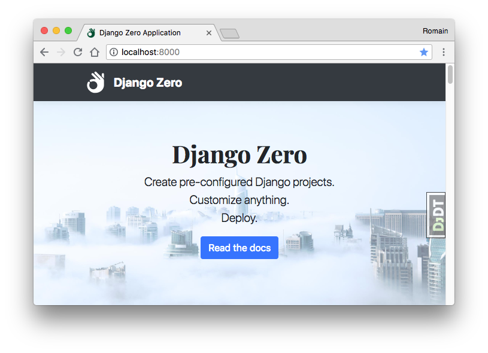

# Django Zero

Django Zero helps creating and maintaining fully-featured, modern and maintainable django applications.

It preinstalls dependencies and provides reasonable defaults, to let you focus on features and business value.



Out of the box, you get a Django project with:
 
- Default settings to start working now.
- Debug Toolbar and Django Extensions.
- Allauth with Jinja2 templates.
- Whitenoise.
- Jinja2 (with django-like filters) and/or Django Template Language (DTL)
- Webpack 4 & Babel for scripts and styles bundling/transpilation (ES6, JSX, SASS).
- Bootstrap 4.1 (easy to remove if you don't want it).
- Build pipeline (various options).

*Note that this documentation **does not** explain the underlying tools, like how to develop using django, we only focus
on what is **django-zero** and it gives links to the other tools.*

## Quick start

You need **Node.js 8+** with **Yarn** and a **python 3.5+** environment (user should have write permissions).

```shell
$ pip install django-zero[dev]
$ django-zero create project acme
$ cd acme
$ django-zero install
$ django-zero manage migrate
$ django-zero start
```

Open http://localhost:8000/, enjoy!

## Table of Content

- [Installation](./install.md)
- [Getting started](./getting-started.md)
- [Guides](./guides/)

    - [Command line](./guides/cli.md)
    - [Development](./guides/develop.md)
    - [Templating](./guides/templating.md)
    - [Frontend](./guides/frontend.md)
    - [Users](./guides/users.md)
    - [Tests](./guides/tests.md)
    - [Deployments](./guides/deployment.md)
    
- [How-to...](./howto/)

- [Contribute](./contributions.md)

## License

Django-Zero is released under Apache License Version 2.0.

Dependencies have their own licenses.


## Status

This is an early preview. We use it on multiple production websites, but you should be aware that things can be a bit
rusty here and there, changes are sometimes necessary, etc. Use at your own risks.

